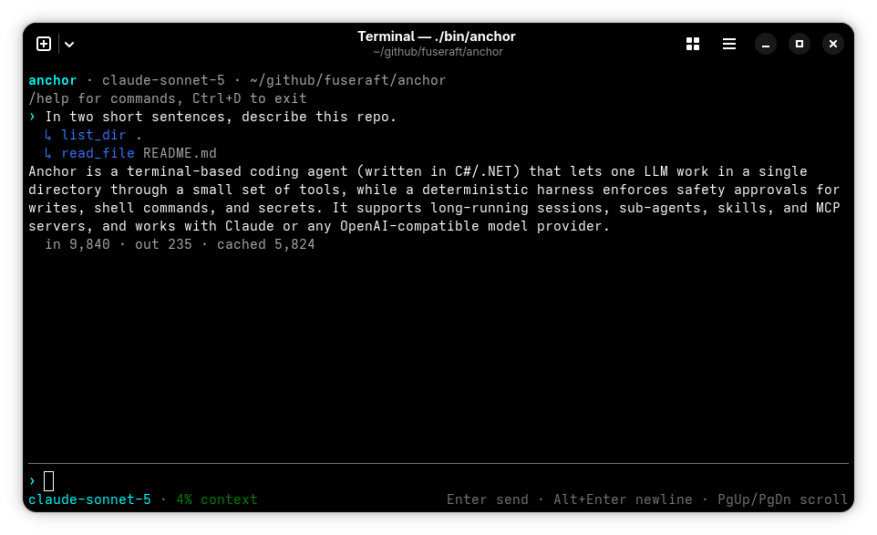

# anchor

[](https://github.com/fuseraft/anchor/actions/workflows/ci.yml)
[](https://github.com/fuseraft/anchor/releases)
[](LICENSE)

A small coding agent for the terminal. One model works in one directory through a handful of
tools, and a deterministic harness decides what it may touch.

**Documentation: [fuseraft.ai/anchor](https://fuseraft.ai/anchor/)**



- **Safe by default.** Writes, most shell commands and reads outside the directory ask first,
  and a write shows you the diff. Secret files (`.env`, keys, credentials) and dangerous
  commands (`sudo`, `rm -rf /`, `curl | sh`) are always denied, even with `--yolo`. Secret
  values are masked in command output.
- **Remembers your "always".** Answering "always" to a command or MCP tool is saved for that
  directory (in your own `~/.anchor`, never the repo), so later sessions and `-p` don't ask again.
  File writes and interpreters like `python3` are only ever allowed for the session.
- **Full-screen terminal UI.** Replies are styled Markdown as they stream, with syntax-highlighted
  code and tables that fit the screen. Keep typing while anchor works, and watch background
  sub-agents in the status line. Attach files with `@path`, open a tool's whole output with
  Ctrl+O, find text with Ctrl+F, search history with Ctrl+R, and `/copy` a reply or code block. The bell rings when
  anchor needs you while you're away. `--plain` gives a line-by-line REPL instead.
- **Long sessions.** Context is kept under the model's window by summarizing older turns,
  trimming old tool output, and as a last resort dropping the oldest steps of a long turn.
  Sessions are saved and can be resumed. `/undo` reverts the last turn's file changes.
- **Extensible.** Sub-agents, Agent Skills (`SKILL.md`) and MCP servers (stdio
  and HTTP, with OAuth sign-in) all go through the same approval checkpoint.
- **Scriptable.** `-p` runs one prompt and prints the answer; `--json` streams events for
  editors and tools.

Status: 0.8.2. Linux, macOS and Windows; on Windows, shell commands run in Git for Windows' bash,
and without it every shell command asks, since the safety rules read bash, not cmd. Models: Claude (native API, prompt caching), and any
OpenAI-compatible API (OpenAI, xAI, local servers).

## Install

Linux and macOS (installs to `~/.local/bin`; pass `--system` for `/usr/local/bin`):

```sh
curl -fsSL https://raw.githubusercontent.com/fuseraft/anchor/main/install.sh | bash
```

Windows (installs to `%LOCALAPPDATA%\anchor\bin` and adds it to your user `PATH`):

```powershell
irm https://raw.githubusercontent.com/fuseraft/anchor/main/install.ps1 | iex
```

With a package manager:

```sh
brew install fuseraft/tap/anchor                                    # macOS and Linux
scoop bucket add fuseraft https://github.com/fuseraft/scoop-bucket  # Windows
scoop install anchor
```

An install from a script or a release archive updates itself: a session downloads a new release
(verified against `SHA256SUMS`) and the next start runs it. Package-manager installs are left to the
package manager. `"autoUpdate": false` in the config turns it off.

Or download a release from the Releases page and put `anchor` on your `PATH`, or build it:

```sh
./build.sh            # runs the tests, then publishes bin/anchor for this machine
```

Building needs the .NET 10 SDK. The tests also need `git` and `python3`.

## Configure

Run `anchor setup` to choose a provider (Anthropic, OpenAI, xAI, or a server such as LiteLLM), save
its key (in the OS keychain, or a private file where there's none) and pick a model. Or set an API key in the environment. With
`ANTHROPIC_API_KEY` or `XAI_API_KEY`, anchor picks a default model; otherwise, or to choose one, pass `--model` or set it in `~/.anchor/config.json`:

```json
{
  "provider": { "model": "claude-sonnet-5" },
  "mcpServers": {
    "docs": { "type": "http", "url": "https://mcp.example.com/mcp" },
    "files": { "command": "npx", "args": ["-y", "@modelcontextprotocol/server-filesystem", "."] }
  }
}
```

For another OpenAI-compatible server, set `provider.endpoint` and `provider.apiKeyEnv`. To reach
many models through one proxy, such as LiteLLM, name it under `providers` and use `<name>/<model>`:

```json
{
  "providers": { "work": { "endpoint": "https://litellm.example.com/v1", "apiKeyEnv": "LITELLM_API_KEY" } },
  "provider": { "model": "work/anthropic.claude-sonnet-5" }
}
```

`provider.contextWindow` overrides the context size. `ANCHOR_HOME` moves `~/.anchor`.

## Use

```sh
anchor                       # interactive
anchor --resume              # continue the latest session in this directory
anchor -p "why does the build fail?"
git diff | anchor -p "review this change"
anchor -p --yolo "fix the failing test"      # -p can't ask, so it refuses unless --yolo
anchor -p --allow edits --allow dotnet "fix the failing test" --max-rounds 40 --timeout 900
```

In the REPL: `/help`, `/model`, `/setup`, `/context`, `/until`, `/compact`, `/approvals`, `/copy`, `/undo`, `/sessions`, `/agents`,
`/skills`, `/mcp` (`/mcp login|logout <server>`), `/clear`, `/exit`. `!cmd` runs a command in
your own shell; the model never sees it. `@path` attaches a file to your message. Ctrl+C cancels the running turn.

`AGENTS.md` in the directory is added to the system prompt.

### Work until a check passes

`/until <command>` makes every turn keep going until the command exits 0. After each turn anchor
runs the command; if it fails, the model gets the output and another round. The loop ends when
the check passes, when a round changes no files, or after 5 rounds. `/until` shows the check,
`/until off` clears it, and `/undo` reverts the whole loop.

```sh
anchor -p --yolo "fix the failing tests" --until "dotnet test"
```

The check is yours, like `!cmd`, so it runs without asking. Its output is masked before the
model sees it. A command decides when the work is done, never a model.

### Sub-agents and skills

- **Sub-agents.** The model can hand a task to a sub-agent with its own context. The default one
  only reads. Define your own in `.agents/agents/<name>.md` or `~/.anchor/agents/<name>.md`:

  ```markdown
  ---
  name: reviewer
  description: Reviews a diff for bugs and missing tests.
  tools: [read_file, grep, glob, shell]
  ---
  Review the change you're given. Report problems with file:line.
  ```

  Sub-agents run in the background, up to 4 at once, while the model keeps working. Their reports
  come back as messages, and the turn waits for every one. Ask how they're doing while it waits,
  and the model checks with `agent_status`.

- **Skills.** Skills live in `.agents/skills/<name>/SKILL.md` or `~/.anchor/skills/<name>/SKILL.md`.
  Only their descriptions are in the prompt; the model loads a skill when a task matches it.

### MCP

MCP servers come from `mcpServers` in the config or from a project's `.mcp.json`, in Claude
Code's format. `${VAR}` in values is replaced from the environment.

- A project's servers can run any program, so anchor asks once per server before starting it.
- Tools a server marks read-only run without asking; the others ask.
- HTTP servers that need OAuth open your browser to sign in. Tokens are kept in the OS keychain.

### JSON mode

`anchor -p "..." --json` prints one JSON event per line and ends with a `result` line.
`anchor --json` is a line protocol for editors:

- It writes `ready`, streams events, and sends `approval_request` with an `id` when an action
  needs approval, or `question` when the model asks a multiple-choice question.
- It reads `{"type":"user_input","text":"..."}`,
  `{"type":"approval_response","id":"a1","answer":"yes|no|always"}`,
  `{"type":"question_response","id":"q2","answer":"..."}` and `{"type":"cancel"}`.

The `result` line has the status, the answer, `files_changed` (written by anchor's file tools), the
session id and token usage. `--allow <rule>` pre-approves a program, an MCP tool
(`mcp__server__tool`) or `edits` for that run only. `--max-rounds <n>` and `--timeout <seconds>`
bound a `-p` run.

Exit codes for `-p`: 0 completed, 1 error, 2 usage, 3 stopped by the loop guard, 4 the `--until`
check never passed, 5 reached `--max-rounds`, 124 reached `--timeout`, 130 cancelled.

## Develop

`DESIGN.md` explains how anchor is put together and why. `./build.sh` runs the tests and
publishes a binary. `dotnet test` runs just the tests.

The documentation site lives in `docs/` and is built with [Starlight](https://starlight.astro.build).
Preview it with `npm install && npm run dev` in that folder. Pushing changes under `docs/` to
`main` deploys it to GitHub Pages.

## License

MIT
